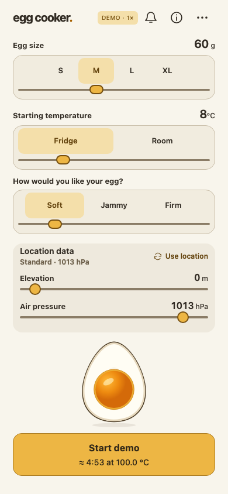

# Egg Cooker

A browser-based, science-informed egg timer with pressure-adjusted estimates, continuous texture controls and an animated egg.

> **Experimental 0.1.0 prerelease.** The software is extensively tested, but its cooking model is not yet kitchen-calibrated. Treat the times as estimates, not as food-safety assurance.

[Try the Egg Cooker](https://chrwittm.github.io/egg-cooker/) · [0.1.0 release](https://github.com/chrwittm/egg-cooker/releases/tag/v0.1.0) · [User guide](docs/user-guide.md) · [Privacy](PRIVACY.md)



## What it does

- Calculates an estimated cooking time from egg mass, starting temperature, desired texture and local air pressure.
- Offers Soft, Jammy and Firm anchors with continuous adjustment between and beyond them.
- Optionally requests the device's location to obtain elevation and current surface pressure, with explicit fallbacks and privacy disclosure.
- Runs the timer, animation and generated audio entirely in the browser.
- Recovers a validated active timer after a same-tab reload when browser storage is available.
- Includes a clearly marked accelerated demo mode for testing and teaching.

The app is a static Svelte 5 and TypeScript site. It has no accounts, analytics, application backend or cloud history.

## Why this repository exists

Egg Cooker is deliberately small enough to show the engineering work that begins after a quick “vibe-coded” prototype appears to work. The repository documents how that prototype became a bounded product with:

- an accepted behavioral specification and explicit non-goals;
- framework-independent domain rules and validated browser boundaries;
- deterministic unit, integration and cross-browser tests;
- privacy, licensing, release and rollback decisions;
- verification records that distinguish automated evidence from human and real-world validation.

The goal is not to suggest that the world needs another egg timer. It is to provide a concrete teaching example of turning a playful prototype into software whose assumptions, risks and release process can be inspected.

## Engineering status

The quick-cook MVP and its accepted interaction refinements are implemented. Formatting, linting, type checks, documentation checks, domain tests and browser tests run through one completion gate:

```sh
npm run verify:all
```

Automated checks cover Chromium, Firefox and WebKit, including the GitHub Pages subpath build. Kitchen calibration, long-term personal-use observations and additional actual-device coverage remain separate [backlog](docs/planning/backlog.md) work. The UI states its cooking-safety and browser-alarm limitations directly.

Start with the [product context](docs/product/context.md), [accepted MVP](docs/product/specifications/0001-mvp.md), [architecture](docs/architecture/overview.md) and [verification evidence](docs/delivery/README.md). The [engineering cookbook](docs/cookbook.md) explains the lightweight specification-to-release method used here.

## Run locally

Use Node 24.20.0 and npm 11.19.0. With nvm installed:

```sh
nvm install
nvm use
npm install --global npm@11.19.0
npm ci
npx playwright install
npm run dev
```

Open the address printed by Vite. On Linux, install browser dependencies with `npx playwright install --with-deps`.

For the same subpath used by GitHub Pages:

```sh
BASE_PATH=/egg-cooker/ npm run verify:all
```

See [testing](docs/testing.md) for focused commands and the limits of automated evidence.

## Privacy and limitations

Location is optional. When activated, rounded coordinates and the device's IP address are sent directly to Open-Meteo for elevation/weather and BigDataCloud for an optional locality label. Coordinates and locality are not persisted by the app. See the full [privacy notice](PRIVACY.md).

Cooking times are model-based estimates. Soft and Jammy eggs are not fully cooked, Firm is not a pasteurization guarantee, browser audio can be suspended, and the illustration is not a measurement inside the egg. See the [user guide](docs/user-guide.md) and [science record](docs/product/specifications/0001-mvp-science.md).

## License

Source code is available under [Apache License 2.0](LICENSE). External environmental data and services retain their own terms and attribution; see [licensing](docs/operations/licensing.md).
