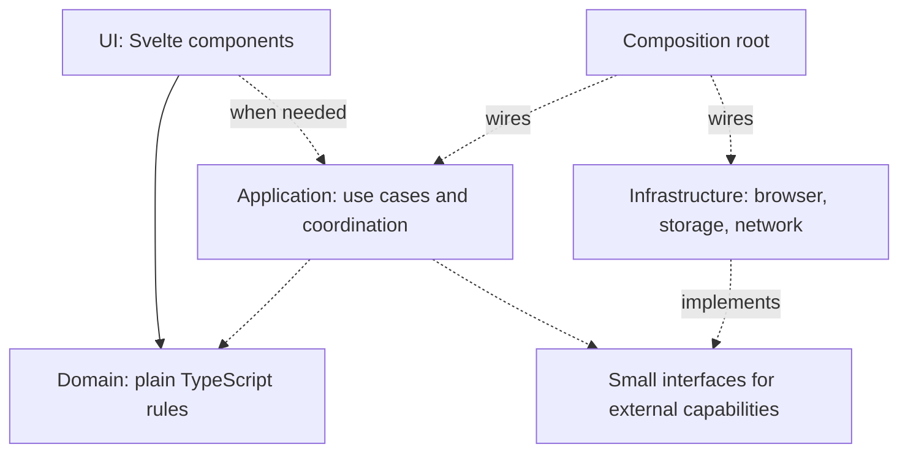

# Stack and architecture

**Status:** Accepted initial egg-cooker baseline; revise only through an explicit product need or successor decision.

The initial egg-cooker foundation is a small static browser application. It adopts the common Svelte/TypeScript/Vite foundation established during portfolio review without importing the other products' platform-specific architecture.

The 2026-09-15 product decision makes GitHub Pages the hard MVP deployment boundary: all calculation, state and animation run in the browser, without an application backend. Subsequent review added direct public elevation/weather APIs for environmental inputs, with a local standard-condition fallback. The [accepted MVP](../product/specifications/0001-mvp.md) defines the implemented two-screen instrument, pure pressure/cooking calculations, a shared real/demo clock, SVG, browser API adapters and tab-local recovery. Kitchen calibration and broader actual-device evidence remain backlog work. Extension recipes and ADR revisit triggers do not authorize bypassing this MVP boundary.

| Component                        | Job                                                                   | Why it is in the default                                                             |
| -------------------------------- | --------------------------------------------------------------------- | ------------------------------------------------------------------------------------ |
| Svelte 5                         | Reactive components and accessible HTML composition                   | Familiar across the projects; concise UI with runes enforced for authored components |
| TypeScript                       | Contracts and static checking                                         | Strict types expose inconsistent assumptions before runtime                          |
| Vite                             | Development server and production bundling                            | Direct fit for a static browser app; no server framework required                    |
| Plain CSS                        | Responsive presentation and focus styles                              | Avoids making a design-system choice before there is a product design                |
| Vitest                           | Fast domain tests and optional coverage                               | Deterministic rule-level feedback                                                    |
| Playwright                       | Chromium, Firefox, WebKit verification of built output                | Tests the user path across browser engines                                           |
| axe-core                         | Automated accessibility checks in browser tests                       | Detects common violations; complements manual checks                                 |
| ESLint / Prettier / svelte-check | Code rules, consistent formatting, Svelte/type checks                 | Repeatable feedback for humans and agents                                            |
| Node 24 / npm 11                 | Build/test runtime and locked dependency installation                 | Common development toolchain; not a backend in the shipped app                       |
| GitHub Actions                   | Source checks, audits, candidate packaging, optional Pages deployment | Makes the documented verification path repeatable                                    |

Exact versions are in `package.json`/`package-lock.json`. The baseline deliberately retains TypeScript 6.0.2 (compatible with the selected lint tooling) and Vitest 4.1.11 (used in the inspected portfolio), rather than adopting their newer major releases just because they exist. All direct packages are exact; compatible transitives are locked. A future copy should verify and review updates, not assume this dated baseline is current forever.

## Dependency direction



`App.svelte` composes the two-screen journey and browser effects. `src/domain/egg.ts` owns pressure/heating and illustration rules; `cook.ts` owns validated sessions, recovery and real/demo time; `environment.ts` validates external payloads. `src/infrastructure/` supplies cancellable location/fetch, non-overlapping foreground audio and failure-isolated storage adapters with injectable dependencies. `src/ui/Egg.svelte` draws the shared SVG. No separate application-service layer or state library is needed for this single journey.

Domain files have a separate TypeScript check with no DOM/Node ambient types and lint restrictions for common forbidden imports/globals. These are useful guardrails, not a complete formal architecture proof; review new aliases and dependencies when expanding the structure. Do not use type escapes to bypass a boundary.

## Repository layout

```text
AGENTS.md, README.md          short agent/human entry points
project.config.json          product display identity and repository URL
src/App.svelte               quick-cook journey and effect composition
src/domain/                 rules + colocated unit tests
tests/e2e/                  critical user flows on the production build
scripts/                    docs check, release preflight and packaging
src/infrastructure/         browser effects and adapter tests
src/ui/                     original egg illustration
docs/product/               current context and numbered specifications
docs/planning/              backlog, defects, current execution pointer
docs/architecture/          boundaries, decisions, optional platform recipes
docs/operations/            releases, security/privacy, licensing, maintenance
docs/templates/             copy-on-demand work records
docs/examples/              clearly labeled worked example
docs/delivery/              dated evidence when warranted
.github/                    CI, dependency updates, candidate/deploy workflows
.local/                     ignored personal learning/scratch/data if created
```

Add feature-oriented subdirectories as behavior grows. Avoid `utils` and `shared` as unrestricted dumping grounds. Tests of pure rules stay beside those rules; broader integration tests can go in `tests/integration/` once needed. Private user fixtures never become the only way a fresh clone can verify.

## State and effects

Use explicit discriminated unions for mutually exclusive product states when combinations of booleans become invalid. Use derived values instead of mirrored state. Introduce a state-machine library only when plain transitions stop being clear. Domain time is an input or injected clock; UI refresh callbacks are not the source of elapsed truth.

Persist explicit, validated, versioned records when persistence is accepted. Do not serialize arbitrary component state. Treat storage/network/device responses as untrusted boundaries, and define recovery for malformed or unavailable data before claiming durability. These contracts belong to the product that needs them; the foundation creates none speculatively.

## Sources

The [Svelte 5 migration guide](https://svelte.dev/docs/svelte/v5-migration-guide) explains the modern runes/event model. [Vite's guide](https://vite.dev/guide/) documents the development/build role. [Playwright's CI guide](https://playwright.dev/docs/ci-intro) covers browser installation and test execution. The structure and staged additions here are project recommendations derived from the inspected repos, not mandates from these tools.

The [0003 refinement](../product/specifications/0003-mobile-interaction.md) keeps one egg DOM node and animates its measured position/size across layout changes with the Web Animations API. Demo intervals split at the exact target before resuming real speed. Manual surface pressure has explicit provenance; it is validated and recovered using the unchanged field set. Existing model results are unchanged.

The [0004 refinement](../product/specifications/0004-continuous-controls.md) adds numeric texture with schema/model v2 while recovering existing named v1 records unchanged. Both are strictly recalculated. A stopped result stays in memory, freezes rendering and removes active storage. An optional localStorage boolean enables a single startup lookup after a granted permission query; a generation counter prevents a late query from overwriting manual values or a cook. Native sliders and preset buttons share compact rails; no custom pointer or keyboard abstraction is needed.

The 2026-09-16 polish keeps the physics unchanged. Native slider thumb insets determine preset-label centers; no pointer/keyboard remapping is added. Optional locality lookup shares cancellation and response limits but never delays weather. Its validated label is presentation-only, never part of the cook schema. Countdown ticks are deduplicated and rate-limited in real time; Ready cues repeat every two seconds until acknowledged/muted. The living MVP now consolidates discovery refinements, while dated evidence remains historical.
