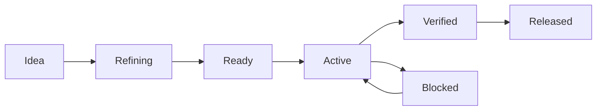

# A solo agentic engineering cookbook

The repository is shared memory and a feedback system. It should tell a new session what matters, make mistakes detectable, and preserve evidence of what actually shipped. It cannot decide whether the product is worth using; that remains a conversation between the maintainer and the software's users.

The useful division of work is role-based: the maintainer owns the intended user outcome, priority, acceptable tradeoffs and real-world acceptance; the coding agent investigates, refines ambiguity, implements, verifies, documents and explains. Either can spot a problem or propose a better design. A specification records the agreement, not a wall between the two roles.

## 1. Start with the smallest useful promise

Describe a real situation: “When I have X, I want to do Y, and know it succeeded because Z.” Distill discovery into a short product context, an MVP boundary, and a parking lot of later ideas. Mark proposed, accepted, researched, and rejected ideas distinctly. Do not promote a compelling brainstorming sentence into an implementation requirement by accident.

The first slice should cross the system: input → rule → visible outcome → test → production build. Polish follows once that path works. A foundation checklist proves the toolchain; it is not evidence that a future cooking model, image parser or sync engine is correct.

**Done for this stage:** someone can explain the first useful outcome, what is excluded, and how to observe success. Investigate the uncertainty most likely to invalidate the product before expanding the UI.

## 2. Give work just enough structure

| Change                                         | Minimum useful record                             | Additional work when warranted                                             |
| ---------------------------------------------- | ------------------------------------------------- | -------------------------------------------------------------------------- |
| Copy/style/config correction                   | Clear task + focused verification                 | No new spec unless behavior changes                                        |
| Small, understood defect                       | Reproduction, expected behavior, regression check | Link an existing BUG item; avoid a plan that restates the fix              |
| New user behavior                              | FEAT item + accepted criteria                     | Feature spec if interaction, failure paths, or boundaries need explanation |
| Multi-session feature                          | Accepted spec + short plan + current handoff      | Dated evidence for meaningful checkpoints                                  |
| Data format, auth, platform, deployment change | Spec + ADR + migration/recovery plan              | Representative integration tests and release gate                          |
| Unknown feasibility                            | Time-bounded investigation with a question        | Record result and decision; discard throwaway code or isolate it           |

A backlog is a queue of possibilities, not a second specification. Use this lifecycle:



Ideas can also be deferred or rejected. `Ready` means scope and expected behavior are clear enough to build; it does not mean implemented. `Verified` means the required code and acceptance checks passed; `Released` additionally points to a version. A feature needing manual acceptance stays Active (implemented, awaiting acceptance), rather than pretending automation established the whole outcome.

Keep one active substantial item by default. No story points, sprint ceremony, duplicate project boards, or forced release-per-feature. Split work when a change becomes hard to review, difficult to undo, or longer than one useful feedback cycle.

## 3. Turn ambiguity into observable acceptance

Use numbered specification names and the [specification index/delivery ledger](product/specifications/README.md): `0001-mvp.md`, then subsequent `NNNN-short-name.md` files as ideas earn detailed specifications. Supporting science/design records share the parent prefix. Keep numbers stable when priorities change; record actual verified slices and releases in the ledger so planned ordering never masquerades as implementation history. Promote deliberately deferred design into a linked real-backlog item; do not lose it or duplicate the discovery inventory.

For the product UI, start by removing unnecessary screens, controls and text. A concise value or direct interaction often makes explanatory copy unnecessary; use contextual details when explanation matters. Simplicity must still preserve accessible names, failure recovery and informed data sharing.

Use [the feature template](templates/feature-specification.md). Specify the user outcome, in/out of scope, interaction states, failure/recovery behavior, data/privacy effects, and acceptance criteria. Every criterion needs a verification method. Define loading, empty, invalid, permission-denied, interrupted, and resumed states where they matter.

Example: “Supports offline” is too vague. “After a successful first load, the primary action remains usable with networking disabled; a failed optional lookup offers manual input” is testable. If a browser cannot guarantee an alarm after suspension, record the limit instead of encoding an impossible promise into a test.

Use a decision record only for durable technical choices with meaningful alternatives. Component names and small refactors rarely need ADRs. A requirement for multi-user access does; it changes ownership, trust boundaries, storage, operations, and the test strategy.

**Ready to implement:** no unanswered question can materially change the accepted behavior, privacy contract, or data model. Routine internal choices remain the agent's job. A user instruction that clearly settles the behavior is sufficient acceptance; record it concisely and proceed.

## 4. Give the agent a bounded task

Use ordinary language, with references that establish the contract:

```text
Implement FEAT-003 from the accepted specification.
Outcome: a user can recover the current session after reload.
Read: product context, FEAT-003, storage ADR, current status.
Preserve: existing saved data; the current no-upload promise.
Complete: the accepted failure/recovery cases, relevant tests,
verify:all, and affected user/operations documentation.
Explain the main tradeoff and identify any unverified device behavior.
```

For continuation: “Resume the active work in docs/planning/status.md.” The handoff should identify the current step, what is complete, exact next action, commands already run, unresolved issues, and relevant files. Inspect the worktree as well as the handoff; neither conversation memory nor a dated report proves the current files are unchanged.

For review: “Review this diff against the accepted criteria. Find concrete behavior, data, and release risks; report reproduction and impact. Do not edit until the review scope calls for fixes.” A separate review pass can reduce anchoring, but an agent reviewing its own work is not equivalent to an independent human audit.

## 5. Choose model effort by the work

Use the user's configured model for ordinary work. Consider a more capable reasoning model for ambiguous architecture, data migration, security-sensitive changes, or a hard failure spanning several layers. A faster model is useful for bounded edits with explicit expectations and strong tests. Increase effort when reasoning is the bottleneck; first shrink the task or improve evidence when context is the bottleneck.

Do not encode transient model names or prices into repo policy. At task time, inspect available options and current official guidance when making a model-specific choice. Compare outcomes on representative tasks: acceptance pass rate, reviewer corrections, elapsed time, and cost where available. “Most expensive for everything” and “cheapest for everything” both avoid the real decision.

Parallel agents are optional. Use them when explicitly chosen and tasks have separate write ownership, a common contract, and an integration owner. Independent review or research often separates better than two agents editing the same app component. Do not create a coordination system before parallel work pays for itself.

## 6. Work in short feedback loops

Read the relevant code, make the smallest coherent change, run the focused check, inspect the diff, and then run the documented completion gate. Use deterministic fixtures; control time and randomness through inputs/adapters when relevant. Fix the underlying cause of a failed check. A dependency override, disabled lint rule, broadened snapshot, or skipped assertion needs a real explanation, not merely a green result.

Bring the highest-risk platform check forward. For localized layout, inspect the longest language at narrow width and text zoom; for sound/icons, get a production preview onto the actual phone while corrections are still cheap. Push the reviewed implementation within existing authorization and inspect Linux CI before release preparation. Local macOS WebKit cannot establish Linux WebKit behavior.

Keep unrelated browser capabilities out of state/presentation tests. A language test can control audio availability, while separate adapter/failure tests and actual-device listening establish the audio contract. Do not mock the integration that a test exists to prove. On failure, record the failing assertion and environment, inspect its trace, and distinguish product behavior, test coupling and runner failure before changing code or retrying.

Use focused checks while editing and one full completion gate on the resulting code. Reuse passing evidence for unchanged source, environment and build path; rerun when any of those relevant inputs change. A fresh Linux candidate and a Pages-path build establish different outputs, but another identical local full run without a new concern adds little. Avoid unrelated refactoring or runtime upgrades during a release correction.

Branches and worktrees isolate experiments and simultaneous work. For a solo project, a short-lived branch and a PR can provide an excellent review artifact; do not require an external reviewer for every small change. A direct, reviewed commit is reasonable for a low-risk correction if repository rules allow it. Avoid mixing feature work with unrelated refactors or toolchain upgrades.

Keep the agent's loop executable with standard scripts. The repository has `verify` for source/build checks and `verify:all` to add production-browser tests. Extend those commands when a new product promise needs another gate; commands repeated only in prose tend to be forgotten.

## 7. Define done without faking certainty

- The agreed behavior and relevant failure paths work.
- Focused tests and required repository gates pass on the resulting code.
- The changed user interaction has appropriate keyboard, focus, responsive, and accessibility checks.
- Actual data/platform risk has integration or manual evidence; unsupported environments are named.
- Affected docs, user instructions, backlog state, and consequential decisions match the implementation.
- Dependency, asset, and privacy changes have been reviewed in context.
- Remaining limits and rollback are explicit; the diff is small enough to understand.

Report “implemented; device acceptance pending” when that is the evidence. Record command, result, source identity, environment, and artifact identity for releases and risky changes. Preserve large logs/screenshots as ignored artifacts or CI attachments, and link a short redacted record. Do not append a report to the repository for every typo.

## 8. Ship the thing that was tested

Follow [releases](operations/releases.md). Source version, tag, build metadata, release notes, and artifact checksum must agree. Test the production build and, when applicable, the installed desktop app, live subpath, persistence restart, or restored backup. A successful development server is insufficient for those promises.

Wait for Linux Verify on the exact release commit and run `release:preflight` before sharing its tag. Use the Linux candidate as the authoritative downloadable artifact, and the reusable `release:smoke` for archive and live checks. Preserve one canonical release evidence record with links from status and the ledger. Acceptance on an earlier source must name the intervening changes; repeat the affected human check after a behavior, layout or asset correction.

Keep preparation and publication distinct so the maintainer can review a concrete artifact. If publication was already authorized, complete it and verify the result without asking again. If it was not, prepare the candidate and request the final decision with its version, evidence, known issues, and distribution target.

## 9. Grow controls when a promise creates responsibility

| Stage/trigger              | Required before claiming it works                                                                               | Defer until needed                                |
| -------------------------- | --------------------------------------------------------------------------------------------------------------- | ------------------------------------------------- |
| Every new project          | Scope, Git, lockfile, strict types, tests, build, basic accessible UI, concise handoff                          | General-purpose infrastructure                    |
| First external tester      | Version, reproducible candidate, supported-platform statement, user guide, known issues, feedback route         | Broad platform support                            |
| Public source/distribution | License/asset review, security channel, dependency monitoring, verified artifact, release/rollback instructions | Telemetry and automatic updates                   |
| First persisted user value | Schema/version, corruption behavior, migration tests, delete/export decision                                    | Database if simple local storage suffices         |
| Offline/PWA promise        | Install/offline/update/recovery matrix and actual devices                                                       | Background features the platform cannot guarantee |
| Native packaging           | Narrow privilege boundary, installed tests, signatures and distribution policy                                  | Additional operating systems                      |
| Backend/accounts           | Authorization tests, secrets, migrations, backups AND restore drill, logs, health, deployment ownership         | Multi-service architecture and orchestration      |

Check these at the milestone where they become relevant. Do not impose a server on a static app to satisfy a generic production checklist.

## 10. Make the process an education loop

After a meaningful change, spend five minutes on: What did we expect? What surprised us? Which check caught a mistake? Which manual decision repeated? What one improvement would help next time? Use the [learning-note template](templates/learning-note.md) locally by default. Public lessons should be distilled and stripped of personal data.

Public engineering records also stay impersonal: use role labels and clearly synthetic examples instead of real names, personal addresses, private locations or household profiles. This applies to current files and to Git history prepared for publication.

Ask Codex to explain one decision using the code that just changed: “Why is this rule outside the component?” or “Which failure can these tests still miss?” Then try predicting the behavior before running a test. This builds your own mental model rather than only accumulating generated documentation.

Track a few useful signals: can a fresh session identify the next action, can a clean clone verify, how often do bugs escape to daily use, how often do docs disagree with code, and how long does a small feature take to reach real feedback? Prefer those over test counts, lines of documentation, or number of agent tasks.

When a practice proves useful across projects, consider extracting it as a separate, deliberately maintained resource. Review and port improvements as ordinary diffs; never overwrite an evolved project wholesale. Extract a shared package or reusable workflow only after repetition reveals a stable interface and a real maintenance saving.

## Codex-specific context

Keep `AGENTS.md` concise and link to detailed policies. Codex discovers project instructions according to directory scope, so start it in the intended repository and verify which guidance is loaded if behavior seems inconsistent. Global personal preferences belong in global instructions; product rules belong in the repository. This follows [official OpenAI documentation on AGENTS.md](https://learn.chatgpt.com/docs/agent-configuration/agents-md). The task briefs and lifecycle above are this repository's working practices, not product-enforced Codex guarantees.
